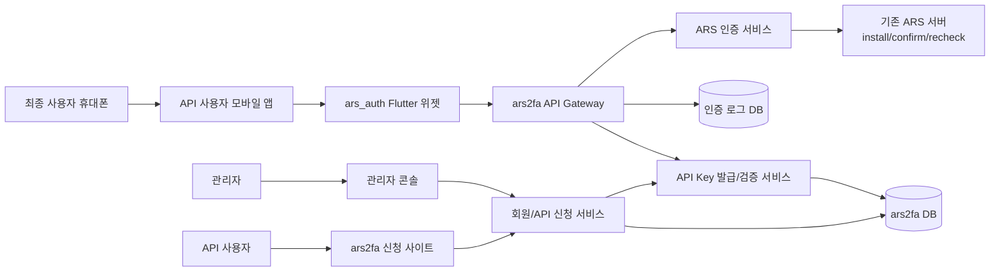
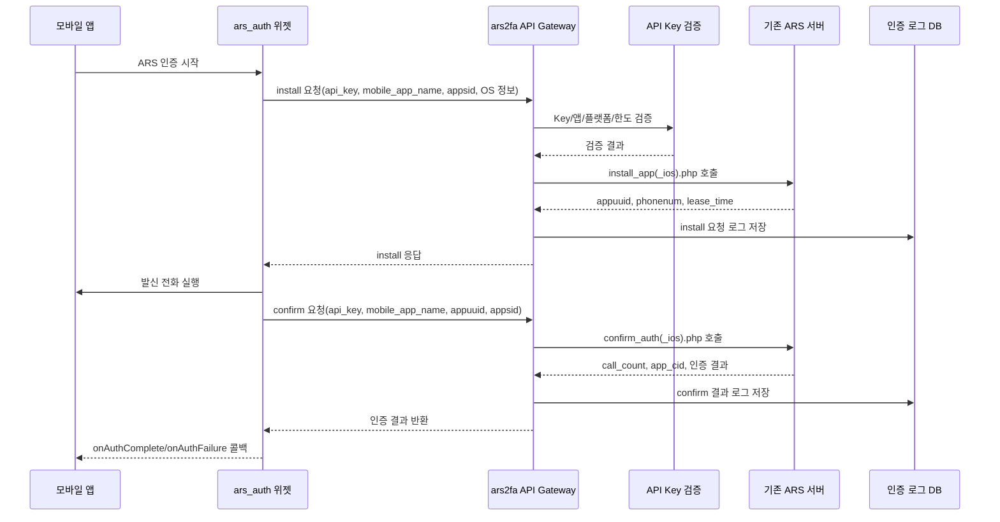
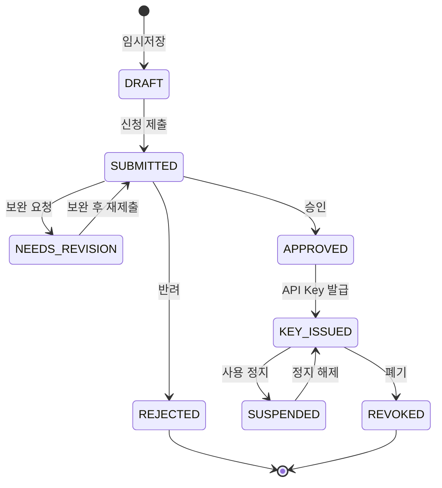

# 02. 기능구조도

## 1. 전체 시스템 구성



## 2. 기능 모듈

| 영역 | 모듈 | 주요 기능 |
|---|---|---|
| 사용자 포털 | 회원 관리 | 회원 가입, 로그인, 비밀번호 재설정, 회사/담당자 정보 관리 |
| 사용자 포털 | API 신청 | 앱명, 플랫폼, 패키지명/번들ID, 사용 목적, 예상 트래픽, callback URL 등록 |
| 사용자 포털 | API Key 관리 | 발급 Key 확인, 재발급 요청, 비활성화 요청, 허용 IP/도메인 설정 |
| 사용자 포털 | 인증 현황 | API Key별 요청/성공/실패/수동인증/오류 현황 조회 |
| 관리자 콘솔 | 신청 심사 | 신청 목록 조회, 상세 검토, 승인, 반려, 보완 요청 |
| 관리자 콘솔 | Key 운영 | Key 발급, 정지, 폐기, 호출 한도 설정, 메모 기록 |
| 관리자 콘솔 | 모니터링 | 전체 사용량, 실패율, 이상 호출, 장애 로그 확인 |
| 인증 API | Key 검증 | `api_key` 상태, 승인 앱, 플랫폼, 한도, IP 제한 검증 |
| 인증 API | ARS 프록시/중계 | 기존 ARS install/confirm/recheck API 호출 전후 로그 적재 |
| 인증 API | 현황 조회 API | API 사용자가 본인 인증 요청 현황을 조회 |

## 3. 사용자 포털 메뉴 구조

```text
ars2fa 사용자 포털
├── 회원
│   ├── 회원 가입
│   ├── 로그인
│   ├── 비밀번호 재설정
│   └── 내 정보/회사 정보
├── API 신청
│   ├── 신규 신청
│   ├── 신청 목록
│   └── 신청 상세/심사 상태
├── API Key
│   ├── 발급 Key 목록
│   ├── Key 상세
│   ├── Key 재발급 요청
│   └── 허용 IP/도메인 설정
├── 인증 현황
│   ├── 대시보드
│   ├── 인증 요청 목록
│   ├── 인증 요청 상세
│   └── 기간별 통계
└── 고객지원
    ├── 공지사항
    └── 문의/장애 접수
```

## 4. 관리자 콘솔 메뉴 구조

```text
ars2fa 관리자 콘솔
├── 대시보드
│   ├── 오늘 요청 수
│   ├── 성공/실패율
│   ├── 수동인증 전환율
│   └── 오류 Top N
├── 회원 관리
│   ├── 회원 목록
│   ├── 회원 상세
│   └── 계정 잠금/해제
├── API 신청 관리
│   ├── 접수 목록
│   ├── 보완 요청
│   ├── 승인
│   └── 반려
├── API Key 관리
│   ├── Key 목록
│   ├── 발급/재발급
│   ├── 정지/폐기
│   └── 호출 한도 관리
├── 인증 로그
│   ├── 전체 요청 목록
│   ├── 실패 로그
│   └── API Key별 로그
└── 시스템 관리
    ├── 관리자 계정
    ├── 권한 그룹
    └── 감사 로그
```

## 5. 인증 API 호출 구조



## 6. 상태 모델

### API 신청 상태



### ARS 인증 요청 상태

| 상태 | 설명 |
|---|---|
| `INSTALL_REQUESTED` | ARS 설치 요청 접수 |
| `INSTALL_SUCCEEDED` | 발신 전화번호와 `appuuid` 발급 성공 |
| `INSTALL_FAILED` | 설치 요청 실패 |
| `CALL_STARTED` | 모바일 앱에서 발신 전화 실행 |
| `CONFIRM_REQUESTED` | 인증 확인 요청 접수 |
| `AUTH_SUCCEEDED` | `call_count = 1`, 인증 성공 |
| `MANUAL_REQUIRED` | `call_count = 2`, 수동 입력 필요 |
| `RETRY_REQUIRED` | `call_count = 0`, 재시도 필요 |
| `AUTH_FAILED` | 인증 실패 |
| `MANUAL_SUCCEEDED` | 수동 인증 성공 |
| `MANUAL_FAILED` | 수동 인증 실패 |

## 7. 주요 화면

| 화면 | 사용자 | 핵심 항목 |
|---|---|---|
| 회원 가입 | API 사용자 | 이메일, 비밀번호, 회사명, 담당자, 연락처, 약관 동의 |
| API 신청 등록 | API 사용자 | 서비스명, 모바일 앱명, 플랫폼, 패키지명/번들ID, 사용 목적, 예상 월 요청 수 |
| 신청 상세 | API 사용자 | 심사 상태, 관리자 의견, 승인/반려 일시 |
| API Key 상세 | API 사용자 | Key 식별자, 상태, 앱명, 한도, 발급일, 최근 사용일 |
| 인증 현황 | API 사용자 | 기간 필터, 요청 목록, 성공/실패 통계, CSV 다운로드 |
| 신청 심사 | 관리자 | 신청 정보, 회원 정보, 보완 요청, 승인/반려 |
| Key 운영 | 관리자 | 발급, 재발급, 정지, 폐기, 한도 설정 |
