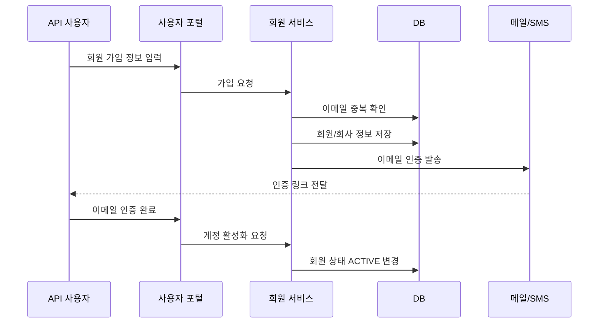
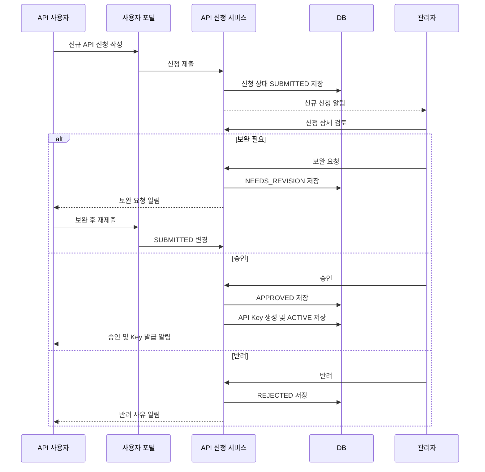
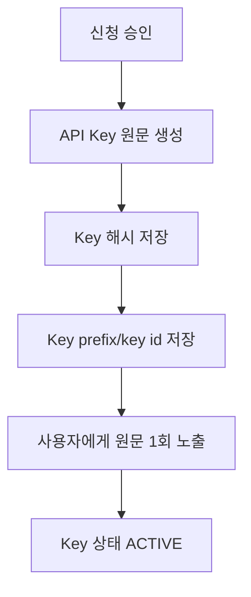
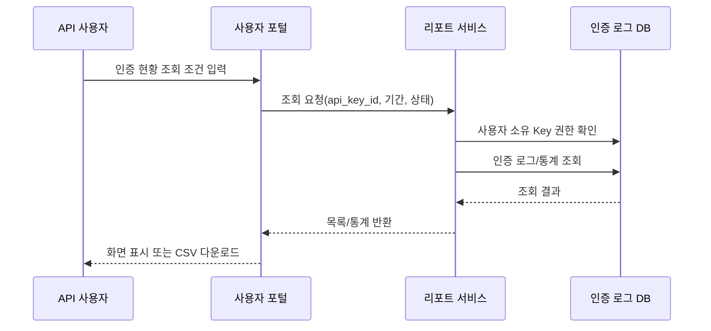

# 03. 사용자/관리자 업무 흐름

## 1. 회원 가입 흐름



### 입력 항목

| 항목 | 필수 | 설명 |
|---|---|---|
| 이메일 | Y | 로그인 ID, 인증 메일 수신 주소 |
| 비밀번호 | Y | 정책: 10자 이상, 영문/숫자/특수문자 조합 권장 |
| 회사명 | Y | API 신청 주체 |
| 사업자등록번호 | 선택 | 사업자 검증이 필요한 경우 사용 |
| 담당자명 | Y | 운영 연락 담당자 |
| 담당자 연락처 | Y | 장애/승인 안내 연락처 |
| 약관 동의 | Y | 서비스 이용약관, 개인정보 처리방침 |

## 2. API 사용 신청 흐름



### 신청 입력 항목

| 항목 | 필수 | 설명 |
|---|---|---|
| 서비스명 | Y | 포털에서 관리할 서비스 명칭 |
| 모바일 앱 명칭 | Y | API 호출 파라미터 `mobile_app_name`과 매칭 |
| 플랫폼 | Y | `ANDROID`, `IOS`, `BOTH` |
| Android 패키지명 | 플랫폼별 | 예: `com.example.app` |
| iOS Bundle ID | 플랫폼별 | 예: `com.example.app` |
| 앱 배포 URL | 선택 | Play Store/App Store/원스토어 URL |
| 사용 목적 | Y | 본인 인증, 회원 가입, 포인트 서비스 등 |
| 예상 월 요청 수 | Y | 한도/승인 심사 기준 |
| 담당자 연락처 | Y | 장애/운영 안내 |
| 허용 서버 IP | 선택 | 서버 간 현황 조회 API 사용 시 제한 |
| 비고/첨부 | 선택 | 사업자등록증, 서비스 소개서 등 |

## 3. 관리자 승인 기준

관리자는 최소 아래 항목을 검토한다.

1. 신청 회원이 실제 API 사용 주체인지 확인.
2. 모바일 앱 명칭과 패키지명/Bundle ID가 신청 내용과 일치하는지 확인.
3. 사용 목적이 휴대폰 인증 API 제공 정책에 맞는지 확인.
4. 예상 트래픽이 기본 한도를 초과하는 경우 별도 협의 여부 확인.
5. 개인정보 처리 및 사용자 고지 문구가 적절한지 확인.
6. 테스트/운영 환경 구분이 필요한지 확인.

## 4. API Key 발급 흐름



### Key 형식 예시

```text
ars2fa_live_4fWm8x...   운영
ars2fa_test_Zp29a...    테스트
```

### Key 정책

- 원문 API Key는 발급 직후 사용자에게 한 번만 보여준다.
- DB에는 `SHA-256` 또는 `HMAC-SHA-256` 해시값만 저장한다.
- Key는 신청 건 및 모바일 앱 정보에 연결한다.
- 재발급 시 기존 Key는 `ROTATED` 또는 `REVOKED` 상태로 전환한다.
- 유출 대응을 위해 관리자는 즉시 `SUSPENDED` 처리할 수 있다.

## 5. ARS 인증 사용 흐름

1. API 사용자가 발급받은 `api_key`와 승인된 `mobile_app_name`을 모바일 앱 설정에 포함한다.
2. 모바일 앱에서 `ars_auth`의 `LoginARS` 위젯을 실행한다.
3. 위젯은 install 요청 시 `api_key`, `mobile_app_name`, OS 정보, 세션 ID를 전송한다.
4. ars2fa API Gateway는 Key 상태, 앱명, 플랫폼, 호출 한도를 검증한다.
5. 검증 성공 시 기존 ARS 서버로 요청을 전달하고 결과를 로그에 저장한다.
6. 사용자가 전화 발신을 완료하면 confirm 요청을 수행한다.
7. 인증 성공/실패/수동 인증 필요 상태가 로그에 저장되고 앱 콜백으로 결과가 전달된다.

## 6. 인증 현황 조회 흐름



### 조회 조건

| 조건 | 설명 |
|---|---|
| 기간 | 기본 최근 7일, 최대 조회 기간은 운영 정책으로 제한 |
| API Key | 사용자가 보유한 Key 중 선택 |
| 모바일 앱 명칭 | 하나의 Key가 여러 앱을 허용할 경우 필터 |
| 플랫폼 | Android/iOS |
| 인증 상태 | 성공, 실패, 수동 인증 필요, 재시도 필요 등 |
| 전화번호 | 원문 검색 금지, 필요한 경우 뒷자리 또는 해시 기반 검색만 허용 |

### 조회 결과 항목

| 항목 | 설명 |
|---|---|
| 요청 시각 | install/confirm 요청 시각 |
| 요청 ID | 내부 추적용 `auth_request_id` |
| API Key 식별자 | Key 원문이 아닌 `key_prefix` 또는 `api_key_id` |
| 모바일 앱 명칭 | 호출 파라미터로 전달된 앱 명칭 |
| 플랫폼 | Android/iOS |
| 상태 | 인증 요청 상태 |
| 전화번호 마스킹 | 예: `010****5678` |
| `appuuid` | 기존 ARS 서버에서 발급한 앱 UUID |
| `appsid` | 앱 세션 ID |
| 실패 사유 | 오류 코드/메시지 |

## 7. 예외 흐름

| 상황 | 처리 |
|---|---|
| 미승인 Key 호출 | `401 UNAUTHORIZED_API_KEY` 반환, 로그 저장 |
| 정지/폐기된 Key 호출 | `403 API_KEY_DISABLED` 반환, 관리자 알림 대상 |
| 앱명 불일치 | `403 APP_NOT_ALLOWED` 반환 |
| 플랫폼 불일치 | `403 PLATFORM_NOT_ALLOWED` 반환 |
| 호출 한도 초과 | `429 RATE_LIMIT_EXCEEDED` 반환 |
| 기존 ARS 서버 장애 | `502 ARS_PROVIDER_ERROR` 반환, 장애 로그 저장 |
| confirm 시 install 로그 없음 | `404 AUTH_SESSION_NOT_FOUND` 반환 |
| 개인정보 조회 과다 | 감사 로그 저장 및 관리자 검토 대상 |
