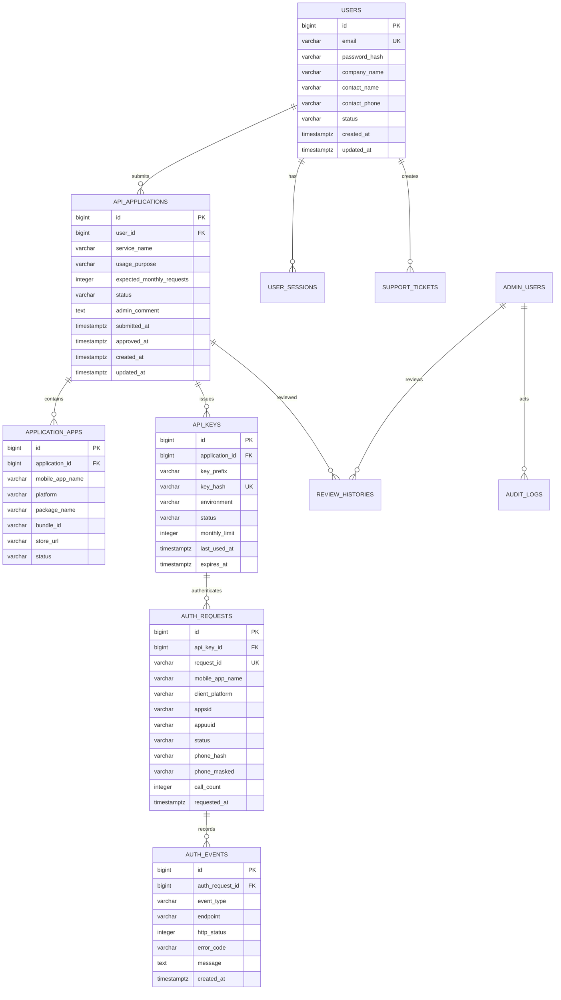

# 05. DB 설계

## 1. 설계 원칙

- 회원, API 신청, API Key, 인증 요청 로그를 분리해 권한과 이력을 명확히 관리한다.
- API Key 원문은 저장하지 않고 해시값만 저장한다.
- 휴대폰 번호는 원문 저장을 피하고, 조회/중복 확인 목적의 해시값과 화면 표시용 마스킹값을 분리 저장한다.
- 신청 승인/반려, Key 정지/폐기 등 운영 행위는 감사 로그에 남긴다.
- 대용량 인증 로그는 기간 파티셔닝 또는 별도 로그 저장소 확장을 고려한다.

## 2. ERD



## 3. 테이블 상세

### 3.1 `users`

API 신청 사이트 사용자 계정.

| 컬럼 | 타입 | 제약 | 설명 |
|---|---|---|---|
| `id` | BIGINT | PK | 사용자 ID |
| `email` | VARCHAR(255) | UNIQUE, NOT NULL | 로그인 ID |
| `password_hash` | VARCHAR(255) | NOT NULL | 비밀번호 해시 |
| `company_name` | VARCHAR(200) | NOT NULL | 회사/조직명 |
| `business_number` | VARCHAR(50) | NULL | 사업자등록번호 |
| `contact_name` | VARCHAR(100) | NOT NULL | 담당자명 |
| `contact_phone` | VARCHAR(50) | NOT NULL | 담당자 연락처 |
| `status` | VARCHAR(30) | NOT NULL | `PENDING_EMAIL`, `ACTIVE`, `SUSPENDED`, `WITHDRAWN` |
| `email_verified_at` | TIMESTAMPTZ | NULL | 이메일 인증 일시 |
| `last_login_at` | TIMESTAMPTZ | NULL | 최근 로그인 |
| `created_at` | TIMESTAMPTZ | NOT NULL | 생성일 |
| `updated_at` | TIMESTAMPTZ | NOT NULL | 수정일 |

인덱스:

- `uk_users_email(email)`
- `idx_users_status(status)`

### 3.2 `user_sessions`

로그인 세션 또는 refresh token 관리.

| 컬럼 | 타입 | 제약 | 설명 |
|---|---|---|---|
| `id` | BIGINT | PK | 세션 ID |
| `user_id` | BIGINT | FK | 사용자 ID |
| `refresh_token_hash` | VARCHAR(255) | NOT NULL | refresh token 해시 |
| `ip_address` | VARCHAR(64) | NULL | 로그인 IP |
| `user_agent` | TEXT | NULL | User-Agent |
| `expires_at` | TIMESTAMPTZ | NOT NULL | 만료일 |
| `revoked_at` | TIMESTAMPTZ | NULL | 폐기일 |
| `created_at` | TIMESTAMPTZ | NOT NULL | 생성일 |

### 3.3 `api_applications`

API 사용 신청 마스터.

| 컬럼 | 타입 | 제약 | 설명 |
|---|---|---|---|
| `id` | BIGINT | PK | 신청 ID |
| `user_id` | BIGINT | FK, NOT NULL | 신청 사용자 |
| `service_name` | VARCHAR(200) | NOT NULL | 서비스명 |
| `usage_purpose` | TEXT | NOT NULL | 사용 목적 |
| `expected_monthly_requests` | INTEGER | NOT NULL | 예상 월 요청 수 |
| `allowed_ips` | TEXT | NULL | 서버 API 허용 IP 목록(JSON 또는 CSV) |
| `callback_url` | VARCHAR(500) | NULL | 향후 비동기 콜백용 |
| `status` | VARCHAR(30) | NOT NULL | `DRAFT`, `SUBMITTED`, `NEEDS_REVISION`, `APPROVED`, `REJECTED`, `SUSPENDED`, `REVOKED` |
| `admin_comment` | TEXT | NULL | 관리자 의견 |
| `submitted_at` | TIMESTAMPTZ | NULL | 제출일 |
| `approved_at` | TIMESTAMPTZ | NULL | 승인일 |
| `rejected_at` | TIMESTAMPTZ | NULL | 반려일 |
| `created_at` | TIMESTAMPTZ | NOT NULL | 생성일 |
| `updated_at` | TIMESTAMPTZ | NOT NULL | 수정일 |

인덱스:

- `idx_api_applications_user_id(user_id)`
- `idx_api_applications_status(status)`
- `idx_api_applications_submitted_at(submitted_at)`

### 3.4 `application_apps`

신청 건에 연결된 모바일 앱 정보.

| 컬럼 | 타입 | 제약 | 설명 |
|---|---|---|---|
| `id` | BIGINT | PK | 앱 정보 ID |
| `application_id` | BIGINT | FK, NOT NULL | API 신청 ID |
| `mobile_app_name` | VARCHAR(200) | NOT NULL | API 파라미터 앱 명칭 |
| `platform` | VARCHAR(20) | NOT NULL | `ANDROID`, `IOS` |
| `package_name` | VARCHAR(255) | NULL | Android 패키지명 |
| `bundle_id` | VARCHAR(255) | NULL | iOS Bundle ID |
| `store_url` | VARCHAR(500) | NULL | 앱스토어 URL |
| `status` | VARCHAR(30) | NOT NULL | `PENDING`, `APPROVED`, `DISABLED` |
| `created_at` | TIMESTAMPTZ | NOT NULL | 생성일 |
| `updated_at` | TIMESTAMPTZ | NOT NULL | 수정일 |

제약:

- `unique(application_id, mobile_app_name, platform)`
- Android는 `package_name`, iOS는 `bundle_id` 입력 권장.

### 3.5 `api_keys`

발급된 API Key.

| 컬럼 | 타입 | 제약 | 설명 |
|---|---|---|---|
| `id` | BIGINT | PK | API Key ID |
| `application_id` | BIGINT | FK, NOT NULL | API 신청 ID |
| `key_prefix` | VARCHAR(40) | NOT NULL | 화면 표시용 prefix |
| `key_hash` | VARCHAR(255) | UNIQUE, NOT NULL | API Key 해시 |
| `environment` | VARCHAR(20) | NOT NULL | `TEST`, `LIVE` |
| `status` | VARCHAR(30) | NOT NULL | `ACTIVE`, `SUSPENDED`, `ROTATED`, `REVOKED`, `EXPIRED` |
| `monthly_limit` | INTEGER | NOT NULL | 월 호출 한도 |
| `rate_limit_per_minute` | INTEGER | NULL | 분당 호출 제한 |
| `last_used_at` | TIMESTAMPTZ | NULL | 최근 사용일 |
| `expires_at` | TIMESTAMPTZ | NULL | 만료일 |
| `created_at` | TIMESTAMPTZ | NOT NULL | 생성일 |
| `updated_at` | TIMESTAMPTZ | NOT NULL | 수정일 |

인덱스:

- `uk_api_keys_key_hash(key_hash)`
- `idx_api_keys_application_id(application_id)`
- `idx_api_keys_status(status)`

### 3.6 `auth_requests`

ARS 인증 요청의 최신 상태.

| 컬럼 | 타입 | 제약 | 설명 |
|---|---|---|---|
| `id` | BIGINT | PK | 내부 ID |
| `request_id` | VARCHAR(80) | UNIQUE, NOT NULL | 외부 노출 요청 ID |
| `api_key_id` | BIGINT | FK, NOT NULL | 사용 API Key |
| `application_app_id` | BIGINT | FK, NULL | 매칭된 모바일 앱 정보 |
| `mobile_app_name` | VARCHAR(200) | NOT NULL | 요청 앱명 |
| `client_platform` | VARCHAR(20) | NOT NULL | `ANDROID`, `IOS` |
| `package_name` | VARCHAR(255) | NULL | 요청 패키지명 |
| `bundle_id` | VARCHAR(255) | NULL | 요청 Bundle ID |
| `appsid` | VARCHAR(255) | NOT NULL | 앱 세션 ID |
| `appuuid` | VARCHAR(100) | NULL | ARS 서버 발급 UUID |
| `appip` | VARCHAR(64) | NULL | ARS 서버 응답 IP |
| `status` | VARCHAR(40) | NOT NULL | 인증 상태 |
| `call_count` | INTEGER | NULL | 기존 ARS 응답 call_count |
| `phone_hash` | VARCHAR(255) | NULL | 전화번호 해시 |
| `phone_masked` | VARCHAR(50) | NULL | 표시용 마스킹 전화번호 |
| `provider_message` | TEXT | NULL | 기존 ARS 서버 메시지 |
| `requested_at` | TIMESTAMPTZ | NOT NULL | 최초 요청일 |
| `confirmed_at` | TIMESTAMPTZ | NULL | confirm 완료일 |
| `created_at` | TIMESTAMPTZ | NOT NULL | 생성일 |
| `updated_at` | TIMESTAMPTZ | NOT NULL | 수정일 |

인덱스:

- `uk_auth_requests_request_id(request_id)`
- `idx_auth_requests_api_key_requested(api_key_id, requested_at DESC)`
- `idx_auth_requests_status(status)`
- `idx_auth_requests_appsid(appsid)`
- `idx_auth_requests_appuuid(appuuid)`
- `idx_auth_requests_phone_hash(phone_hash)`

### 3.7 `auth_events`

install/confirm/recheck 각 단계의 이벤트 로그.

| 컬럼 | 타입 | 제약 | 설명 |
|---|---|---|---|
| `id` | BIGINT | PK | 이벤트 ID |
| `auth_request_id` | BIGINT | FK, NULL | 인증 요청 ID. Key 검증 실패 등 요청 생성 전 오류는 NULL 가능 |
| `api_key_id` | BIGINT | FK, NULL | API Key ID |
| `event_type` | VARCHAR(50) | NOT NULL | `INSTALL`, `CONFIRM`, `RECHECK`, `STATUS_QUERY`, `ERROR` |
| `endpoint` | VARCHAR(100) | NOT NULL | 호출 API |
| `http_status` | INTEGER | NULL | 응답 HTTP 상태 |
| `error_code` | VARCHAR(80) | NULL | 오류 코드 |
| `message` | TEXT | NULL | 메시지 |
| `request_payload_masked` | JSONB | NULL | 민감정보 제거 요청값 |
| `response_payload_masked` | JSONB | NULL | 민감정보 제거 응답값 |
| `ip_address` | VARCHAR(64) | NULL | 호출 IP |
| `user_agent` | TEXT | NULL | User-Agent |
| `created_at` | TIMESTAMPTZ | NOT NULL | 생성일 |

인덱스:

- `idx_auth_events_auth_request_id(auth_request_id)`
- `idx_auth_events_created_at(created_at DESC)`
- `idx_auth_events_error_code(error_code)`

### 3.8 `review_histories`

API 신청 심사 이력.

| 컬럼 | 타입 | 제약 | 설명 |
|---|---|---|---|
| `id` | BIGINT | PK | 이력 ID |
| `application_id` | BIGINT | FK, NOT NULL | 신청 ID |
| `admin_user_id` | BIGINT | FK, NOT NULL | 관리자 ID |
| `from_status` | VARCHAR(30) | NULL | 이전 상태 |
| `to_status` | VARCHAR(30) | NOT NULL | 변경 상태 |
| `comment` | TEXT | NULL | 관리자 의견 |
| `created_at` | TIMESTAMPTZ | NOT NULL | 생성일 |

### 3.9 `admin_users`

관리자 계정.

| 컬럼 | 타입 | 제약 | 설명 |
|---|---|---|---|
| `id` | BIGINT | PK | 관리자 ID |
| `email` | VARCHAR(255) | UNIQUE, NOT NULL | 로그인 ID |
| `password_hash` | VARCHAR(255) | NOT NULL | 비밀번호 해시 |
| `name` | VARCHAR(100) | NOT NULL | 이름 |
| `role` | VARCHAR(50) | NOT NULL | `SUPER_ADMIN`, `REVIEWER`, `OPERATOR` |
| `status` | VARCHAR(30) | NOT NULL | `ACTIVE`, `SUSPENDED` |
| `last_login_at` | TIMESTAMPTZ | NULL | 최근 로그인 |
| `created_at` | TIMESTAMPTZ | NOT NULL | 생성일 |
| `updated_at` | TIMESTAMPTZ | NOT NULL | 수정일 |

### 3.10 `audit_logs`

관리/운영 행위 감사 로그.

| 컬럼 | 타입 | 제약 | 설명 |
|---|---|---|---|
| `id` | BIGINT | PK | 감사 로그 ID |
| `actor_type` | VARCHAR(30) | NOT NULL | `USER`, `ADMIN`, `SYSTEM` |
| `actor_id` | BIGINT | NULL | 행위자 ID |
| `action` | VARCHAR(100) | NOT NULL | 행위명 |
| `target_type` | VARCHAR(50) | NOT NULL | 대상 타입 |
| `target_id` | VARCHAR(80) | NULL | 대상 ID |
| `details` | JSONB | NULL | 상세 내용 |
| `ip_address` | VARCHAR(64) | NULL | IP |
| `created_at` | TIMESTAMPTZ | NOT NULL | 생성일 |

## 4. 상태 코드 정의

### 4.1 API 신청 상태

| 상태 | 설명 |
|---|---|
| `DRAFT` | 사용자 임시 저장 |
| `SUBMITTED` | 심사 접수 |
| `NEEDS_REVISION` | 관리자 보완 요청 |
| `APPROVED` | 승인 |
| `REJECTED` | 반려 |
| `SUSPENDED` | 승인 후 사용 정지 |
| `REVOKED` | 승인 취소/폐기 |

### 4.2 API Key 상태

| 상태 | 설명 |
|---|---|
| `ACTIVE` | 사용 가능 |
| `SUSPENDED` | 일시 정지 |
| `ROTATED` | 재발급으로 교체됨 |
| `REVOKED` | 폐기 |
| `EXPIRED` | 만료 |

### 4.3 인증 요청 상태

| 상태 | 설명 |
|---|---|
| `INSTALL_REQUESTED` | install 요청 접수 |
| `INSTALL_SUCCEEDED` | install 성공 |
| `INSTALL_FAILED` | install 실패 |
| `CONFIRM_REQUESTED` | confirm 요청 접수 |
| `AUTH_SUCCEEDED` | 인증 성공 |
| `MANUAL_REQUIRED` | 수동 인증 필요 |
| `RETRY_REQUIRED` | 재시도 필요 |
| `AUTH_FAILED` | 인증 실패 |
| `MANUAL_SUCCEEDED` | 수동 인증 성공 |
| `MANUAL_FAILED` | 수동 인증 실패 |

## 5. 개인정보 저장 정책

| 데이터 | 저장 방식 |
|---|---|
| API Key | 원문 미저장, 해시 저장 |
| 휴대폰 번호 | 원문 미저장, `phone_hash`, `phone_masked` 저장 |
| 요청/응답 payload | API Key, 전화번호 등 민감정보 마스킹 후 저장 |
| 관리자 의견 | 개인정보 입력 방지를 UI에서 안내 |
| 감사 로그 | 접근자, 행위, 대상, IP 중심으로 저장 |

전화번호 해시는 단순 SHA-256보다 서버 비밀값을 사용하는 HMAC 방식을 권장한다.

```text
phone_hash = HMAC_SHA256(server_secret, normalized_phone_number)
```

## 6. 통계 조회용 뷰

운영 화면 성능을 위해 일/월 단위 집계 테이블 또는 materialized view를 둘 수 있다.

### `daily_auth_statistics`

| 컬럼 | 타입 | 설명 |
|---|---|---|
| `stat_date` | DATE | 집계일 |
| `api_key_id` | BIGINT | API Key ID |
| `application_app_id` | BIGINT | 앱 정보 ID |
| `client_platform` | VARCHAR(20) | 플랫폼 |
| `total_count` | INTEGER | 전체 요청 |
| `success_count` | INTEGER | 성공 |
| `failed_count` | INTEGER | 실패 |
| `manual_required_count` | INTEGER | 수동 인증 필요 |
| `retry_required_count` | INTEGER | 재시도 필요 |

제약:

- `unique(stat_date, api_key_id, application_app_id, client_platform)`

## 7. 삭제/보관 정책

| 데이터 | 보관 정책 |
|---|---|
| 회원 계정 | 탈퇴 후 법적 보관 기간이 지나면 식별정보 삭제 또는 익명화 |
| API 신청/승인 이력 | 운영 감사 목적으로 장기 보관 |
| 인증 요청 로그 | 상세 로그는 단기 보관, 집계 데이터는 장기 보관 |
| API Key 해시 | 폐기 후에도 감사 목적 보관 가능 |
| 감사 로그 | 관리자 행위 추적을 위해 장기 보관 |
