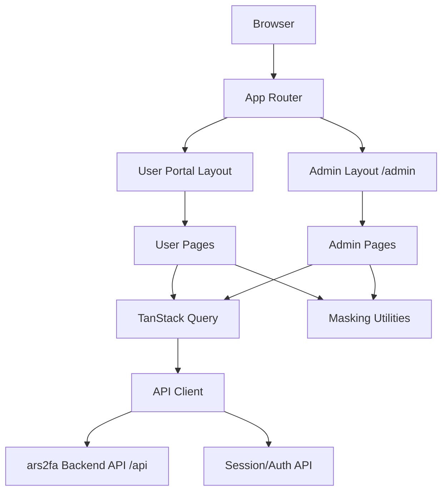
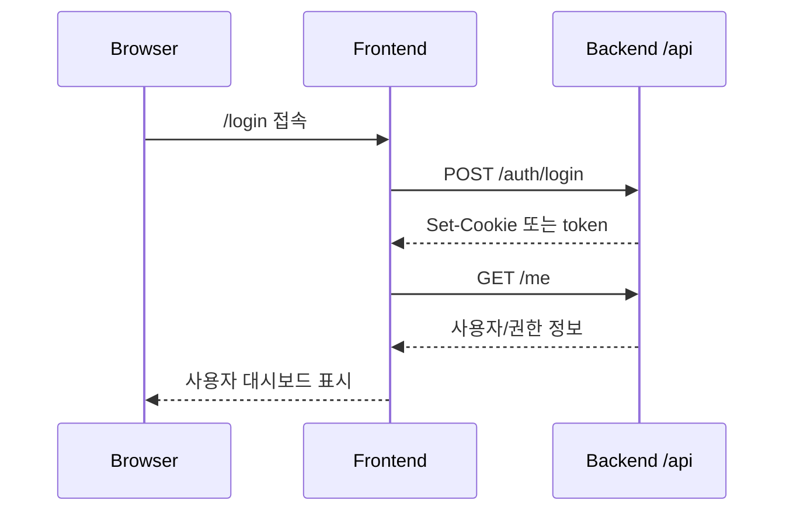
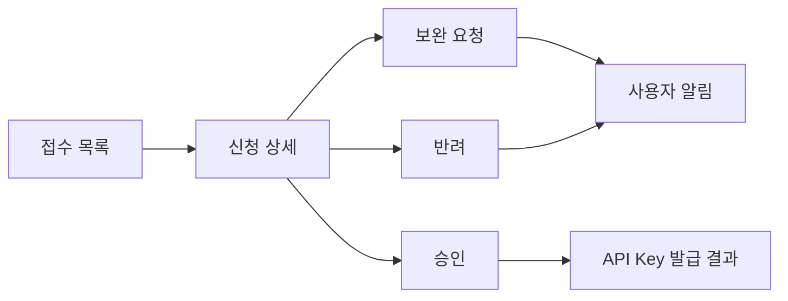

# 08. 프론트엔드 아키텍처

## 1. 목적

이 문서는 `ars2fa` 사용자 포털과 관리자 콘솔의 프론트엔드 구조를 정의한다.

프론트엔드는 단일 도메인 `https://ars2fa.baro.me`에서 동작하며, 사용자 포털은 루트 경로(`/`), 관리자 콘솔은 `/admin` 경로를 사용한다.

## 2. 설계 원칙

- 사용자 포털과 관리자 콘솔은 같은 배포 단위로 시작하되, 라우팅/권한/메뉴/상태를 명확히 분리한다.
- 관리자 권한 검사는 프론트엔드 가드에 의존하지 않고 백엔드 API에서 반드시 재검증한다.
- API Key 원문은 발급 직후 1회만 화면에 표시하고, 이후에는 prefix와 Key ID만 표시한다.
- 휴대폰 번호와 API Key는 화면, console log, error tracking payload에서 마스킹한다.
- 초기 단계(Coolify 단일 서버)에서 단순하게 배포하고, 확장 단계에서 사용자 포털/Admin SPA 분리 배포가 가능하도록 디렉터리와 라우팅을 설계한다.

## 3. 기술 스택 권장안

| 영역 | 권장 | 설명 |
|---|---|---|
| Framework | React + TypeScript 또는 Next.js | Coolify/Node 기반 배포와 관리 편의성 |
| Build | Vite 또는 Next.js build | 초기에는 SPA 배포가 단순 |
| Routing | React Router 또는 Next App Router | `/`, `/admin` path 기반 라우팅 |
| Server State | TanStack Query | API 조회/캐시/무효화 표준화 |
| Client State | Zustand 또는 Context | 로그인 사용자, UI 상태, 단기 wizard 상태 |
| Form | React Hook Form + Zod | 신청/승인 폼 검증 |
| UI | shadcn/ui, MUI, Ant Design 중 택1 | 관리자 테이블/폼/필터 생산성 |
| Chart | Recharts 또는 ECharts | 인증 현황/통계 시각화 |
| API Client | Fetch wrapper 또는 Axios | 인증 토큰, 오류 처리, request id 표준화 |
| Test | Vitest + Testing Library | 폼/권한/라우팅 단위 테스트 |

프레임워크가 확정되지 않은 상태라면 초기 구현은 `React + TypeScript + Vite + TanStack Query` 구성이 가장 단순하다. SSR이 필수인 공개 마케팅 페이지가 생기면 Next.js 전환을 검토한다.

## 4. 전체 구조

```text
https://ars2fa.baro.me
  ├── /                         사용자 포털 홈/대시보드
  ├── /signup                   회원 가입
  ├── /login                    사용자 로그인
  ├── /applications             API 신청 목록
  ├── /applications/new         API 신규 신청
  ├── /applications/:id         API 신청 상세
  ├── /api-keys                 API Key 목록
  ├── /api-keys/:id             API Key 상세
  ├── /auth-requests            인증 요청 현황
  ├── /statistics               인증 통계
  └── /admin                    관리자 콘솔
      ├── /admin/login          관리자 로그인
      ├── /admin                관리자 대시보드
      ├── /admin/applications   신청 심사
      ├── /admin/api-keys       API Key 운영
      ├── /admin/users          회원 관리
      ├── /admin/auth-logs      인증 로그
      └── /admin/audit-logs     감사 로그
```

## 5. 프론트엔드 런타임 구성도



## 6. 디렉터리 구조 권장안

```text
apps/frontend/
  src/
    app/
      App.tsx
      routes.tsx
      providers.tsx
    pages/
      public/
        HomePage.tsx
        LoginPage.tsx
        SignupPage.tsx
      user/
        DashboardPage.tsx
        ApplicationListPage.tsx
        ApplicationFormPage.tsx
        ApplicationDetailPage.tsx
        ApiKeyListPage.tsx
        ApiKeyDetailPage.tsx
        AuthRequestListPage.tsx
        StatisticsPage.tsx
      admin/
        AdminLoginPage.tsx
        AdminDashboardPage.tsx
        AdminApplicationReviewPage.tsx
        AdminApiKeyPage.tsx
        AdminUserPage.tsx
        AdminAuthLogPage.tsx
        AdminAuditLogPage.tsx
    features/
      auth/
      applications/
      apiKeys/
      authRequests/
      statistics/
      admin/
    shared/
      api/
        client.ts
        errors.ts
        queryKeys.ts
      components/
      constants/
      hooks/
      layouts/
      lib/
        mask.ts
        date.ts
        validators.ts
      types/
```

## 7. 라우팅 설계

### 7.1 사용자 라우트

| 경로 | 화면 | 권한 |
|---|---|---|
| `/` | 포털 홈 또는 사용자 대시보드 | 공개/로그인 후 대시보드 |
| `/signup` | 회원 가입 | 비로그인 |
| `/login` | 로그인 | 비로그인 |
| `/applications` | API 신청 목록 | 사용자 |
| `/applications/new` | API 신규 신청 | 사용자 |
| `/applications/:id` | API 신청 상세 | 신청 소유자 |
| `/api-keys` | API Key 목록 | 사용자 |
| `/api-keys/:id` | API Key 상세 | Key 소유자 |
| `/auth-requests` | 인증 요청 현황 | 사용자 |
| `/statistics` | 인증 통계 | 사용자 |

### 7.2 관리자 라우트

| 경로 | 화면 | 권한 |
|---|---|---|
| `/admin/login` | 관리자 로그인 | 비로그인 관리자 |
| `/admin` | 관리자 대시보드 | 관리자 |
| `/admin/applications` | API 신청 심사 목록 | `REVIEWER` 이상 |
| `/admin/applications/:id` | API 신청 심사 상세 | `REVIEWER` 이상 |
| `/admin/api-keys` | API Key 운영 | `KEY_MANAGER` 이상 |
| `/admin/users` | 회원 관리 | `OPERATOR` 이상 |
| `/admin/auth-logs` | 인증 로그 조회 | `OPERATOR` 이상 |
| `/admin/audit-logs` | 감사 로그 조회 | `SUPER_ADMIN` |

## 8. 화면 구조

### 8.1 사용자 포털 화면

| 화면 | 핵심 기능 |
|---|---|
| 대시보드 | 신청 상태, 활성 Key 수, 최근 인증 요청, 성공률 요약 |
| 회원 가입 | 이메일 인증, 회사/담당자 정보, 약관 동의 |
| API 신청 등록 | 서비스명, 모바일 앱 명칭, 플랫폼, 패키지명/Bundle ID, 사용 목적, 예상 월 요청 수 |
| 신청 상세 | 심사 상태, 관리자 의견, 보완 요청, 승인/반려 이력 |
| API Key 상세 | Key prefix, 상태, 한도, 최근 사용일, 재발급/정지 요청 |
| 인증 현황 | 기간/Key/앱/상태 필터, 목록, 상세, CSV 다운로드 |
| 통계 | 일별/월별 요청 수, 성공률, 실패율, 수동 인증 전환율 |

### 8.2 관리자 콘솔 화면

| 화면 | 핵심 기능 |
|---|---|
| 관리자 대시보드 | 전체 요청 수, 성공률, 실패율, 장애/이상 호출 알림 |
| 신청 심사 | 접수/보완/승인/반려 처리, 관리자 의견 등록 |
| Key 운영 | Key 발급, 재발급, 정지, 폐기, 호출 한도 변경 |
| 회원 관리 | 회원 상태 확인, 계정 잠금/해제 |
| 인증 로그 | 전체 인증 요청 조회, 실패 원인 분석, API Key별 필터 |
| 감사 로그 | 관리자 작업 이력, CSV 다운로드 이력, 권한 변경 이력 |

## 9. 상태 관리

### 9.1 서버 상태

TanStack Query의 query key를 업무 도메인별로 분리한다.

```text
auth.currentUser
applications.list(filters)
applications.detail(applicationId)
apiKeys.list(applicationId)
apiKeys.detail(apiKeyId)
authRequests.list(filters)
statistics.summary(filters)
admin.applications.pending(filters)
admin.auditLogs.list(filters)
```

상태 변경 후에는 관련 query를 무효화한다.

| Mutation | Invalidate |
|---|---|
| API 신청 제출 | `applications.list`, `applications.detail` |
| 보완 후 재제출 | `applications.detail`, `admin.applications.pending` |
| 관리자 승인/반려 | `applications.detail`, `admin.applications.pending`, `apiKeys.list` |
| Key 재발급 | `apiKeys.list`, `apiKeys.detail` |
| Key 정지/폐기 | `apiKeys.list`, `apiKeys.detail`, `statistics.summary` |

### 9.2 클라이언트 상태

| 상태 | 저장 위치 |
|---|---|
| 로그인 사용자 요약 | Query cache |
| access token | HttpOnly cookie 권장. 불가 시 memory 우선 |
| sidebar 접힘/테마 | localStorage 가능 |
| API 신청 wizard 임시 상태 | form state 또는 sessionStorage |
| 관리자 필터 조건 | URL query string |

## 10. API Client 설계

### 10.1 요청 공통 처리

- `credentials: 'include'` 또는 Authorization token 정책을 일관되게 적용한다.
- 모든 요청에 `X-Request-Id`를 생성해 전달한다.
- `401`은 로그인 만료 처리, `403`은 권한 없음 화면으로 분기한다.
- `429`는 rate limit 메시지와 재시도 가능 시각을 표시한다.
- API Key와 전화번호가 포함된 오류 payload는 화면 표시 전에 마스킹한다.

```ts
type ApiError = {
  status: number;
  code: string;
  message: string;
  requestId?: string;
};
```

### 10.2 API Base URL

```env
VITE_APP_URL=https://ars2fa.baro.me
VITE_API_BASE_URL=https://ars2fa.baro.me/api
VITE_ADMIN_BASE_PATH=/admin
```

ARS 인증 API(`/v1/ars/*`)는 모바일 앱/SDK가 호출하는 API이므로 포털 프론트엔드에서는 테스트 호출 화면 또는 문서 예제에서만 사용한다.

## 11. 인증/권한 설계

### 11.1 사용자 인증



### 11.2 관리자 인증

- `/admin` 진입 시 관리자 세션을 확인한다.
- 프론트엔드 `AdminRouteGuard`는 UX를 위한 1차 가드만 수행한다.
- 관리자 API는 백엔드에서 role을 재검증한다.
- `SUPER_ADMIN`, `REVIEWER`, `OPERATOR`, `KEY_MANAGER` 역할별 메뉴 노출을 분리한다.

## 12. 보안/마스킹

| 대상 | 처리 |
|---|---|
| API Key 원문 | 발급 직후 1회 표시, clipboard 복사 후 재표시 불가 |
| API Key 목록 | `ars2fa_live_abcd...wxyz` 형태 prefix/마스킹 표시 |
| 전화번호 | `010****1234` 형태 표시 |
| CSV 다운로드 | 권한 확인, 다운로드 사유 입력, 감사 로그 생성 |
| console log | 운영 빌드에서 제거 또는 민감정보 필터링 |
| Error tracking | request/response body에서 `api_key`, `app_cid`, `appphone` 제거 |

## 13. 인증 현황 UI 설계

### 13.1 목록 필터

| 필터 | 설명 |
|---|---|
| 기간 | 기본 최근 7일, 최대 기간 제한 |
| API Key | 사용자가 소유한 Key |
| 모바일 앱 명칭 | `mobile_app_name` |
| 플랫폼 | Android/iOS |
| 상태 | 성공/실패/수동 인증/재시도 |
| 전화번호 | 원문 검색 금지, 뒷자리 또는 해시 기반 검색만 제공 |

### 13.2 상세 화면

- 요청 ID.
- 앱명, 플랫폼, package/bundle.
- `appsid`, `appuuid`.
- 상태 전이 timeline.
- provider 메시지.
- 마스킹된 전화번호.
- 오류 코드와 조치 가이드.

## 14. 관리자 심사 UI 설계



심사 상세 화면은 아래 정보를 한 화면에서 비교할 수 있어야 한다.

- 신청 회원/회사 정보.
- 서비스명/사용 목적.
- 모바일 앱 명칭.
- Android 패키지명/iOS Bundle ID.
- 예상 월 요청 수.
- 보완/승인/반려 이력.
- 관리자 메모.

## 15. 배포 구조

초기 Coolify 구성:

```text
apps/frontend
  ├── build command: npm run build
  └── output: dist

ars2fa.baro.me
  ├── /      -> frontend
  ├── /admin -> frontend SPA fallback
  └── /api, /v1/ars -> backend
```

본격 운영 단계:

```text
NPM
  ├── /, /admin -> VM-02 Frontend :5173
  ├── /api/*    -> VM-02 Backend  :3000
  └── /v1/ars/* -> VM-02 Backend  :3000
```

## 16. 테스트 전략

| 테스트 | 대상 |
|---|---|
| Unit | 마스킹 유틸, validator, role guard |
| Component | 신청 폼, Key 발급 결과, 인증 로그 테이블 |
| Integration | 로그인, 신청 제출, 관리자 승인, Key 목록 갱신 |
| E2E | 사용자 가입 -> API 신청 -> 관리자 승인 -> Key 확인 -> 인증 현황 조회 |
| Accessibility | 주요 폼/테이블 키보드 조작, label, contrast |

## 17. 향후 분리 기준

아래 조건이 발생하면 사용자 포털과 관리자 콘솔을 별도 앱으로 분리할 수 있다.

- 관리자 기능이 많아져 번들 크기와 배포 주기가 사용자 포털과 달라진다.
- 관리자 콘솔을 VPN 또는 내부망 전용으로 완전히 분리해야 한다.
- 사용자 포털은 공개 마케팅/SEO가 중요해 SSR이 필요하다.
- 관리자 콘솔에 별도 디자인 시스템 또는 권한 모델이 필요하다.
